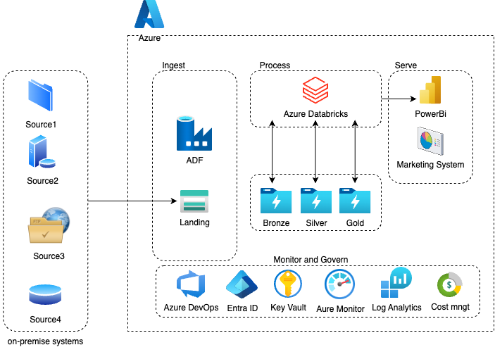

# Case Study: Transition to Cloud-Based Azure Storage at XYZ Bank

XYZ Bank has decided to transition from using a traditional Datawarehouse to a centralized, cloud-based Azure storage solution. To facilitate this shift, mechanisms have been established within On-Prem systems and other sources to transmit incremental daily snapshots of data to Azure Data Lake Storage.

- Historically, the Marketing System (MS) accessed necessary datasets daily from the Datawarehouse to generate dashboards. With the bank’s strategic pivot, the MS team now needs to design a system to ingest these datasets daily from the centralized storage into their designated storage account. Additionally, they must perform the necessary operations on the datasets to ensure they are readily accessible for dashboarding purposes.
- As Senior Azure Engineers, it is crucial that we collaborate to develop a scalable solution to meet the MS team’s requirements.

# Migration Solution
## Introduction
Based on the description the solution will be designed to migrate data from traditional data warehouse to a centralized Azure based system data integration.
### Key considerations:
- Data from source storage account must be securely transfered between systems and application.
- Ideally the storage accounts should be segregated by departments creating a new layer for data security aspects.
- The system needs to accomodate daily incremental data loads and ensure scalabilty.

## Proposed solution
## ADF
Leveraging the usage of the Azure Data Factory (ADF) to deal with the data movement from source to the process layer.
### Key Considerations for the usage:
- Linked services: ADF will be securily connected to both source storage and the ADLS gen2 where data will be stored
- Incremental data load: pipelines can be configured with ADF mapping data flow (https://learn.microsoft.com/en-us/azure/data-factory/concepts-change-data-capture#auto-incremental-extraction-in-mapping-data-flow) to detect and load only the changed data.
- Data orchestration: Pipelines will be orchestrated to the ingestion of daily incremental snapshots from source into ADLS.
- Monitoring & Logging: ADF has monitoring and alerting capabilities for failed or slow data loads.
- Scalablity: ADF pipelines can scale to handle large volumes of data.

## Azure Datalake Storage
Centralized solution for storing processed data that can be easily and quickly scaled to meet demanding customer workloads. It is highly secure with flexible mechanisms for data access protection, encryption and network-level control.
### Key Considerations for the usage:
- Access Controls: RBAC and Azure AD integration will be utilized to manage permissions at the container and file level, ensuring only authorized users can access the data.
- Liked services: The access from ADF can be integrated using linked services while Databricks can use Managed Identity with RBAC role privilege to access the data.

## Databricks
Once data lands in ADLS we'll perform transformations to conform and prepare the data for reporting and dashboarding. Employing the Unity Catalog we can also manage security, governance, audit, and apply fine-grained access to data creating catalogs per department, for instance. Unity Catalog also captures lineage data that tracks how data assets are created.
### Key Considerations for the usage:
- Data Daily processing: Daily snapshots will be processed using Databricks, performing necessary transformations like, aggregations, joins, and producing the curated data.
- Data Governance and Security: Unity Catalog for centralized governance for data management, including fine-grained access control at the table and column levels for the Marketing team.
- Audit Logs: All access and usage of datasets will be logged for security and compliance purposes. This is particularly important in a banking context for traceability.
- Incremental data loads: Leverage the usage of Auto Loader (https://learn.microsoft.com/en-us/azure/databricks/ingestion/cloud-object-storage/auto-loader/) for incremental data loads, and implying the usage of delta lake format to ensure ACID transactions.
- Integration with PowerBI: Databricks can directely integrate with PowerBI, providing secure conectivity to the datasets for Dashboarding purposes.
- Scalability: Databricks auto-scaling will allow the processing to grow with data size.

## Security considerations
- Networking: Private endpoints will be implemented for comunnication between ADLS, ADF, and Databricks to ensure that traffic is limited to the priate network.
- AAD auth: All resources will be secured using AAD for user authentication, and service principals, managed identity for services authentication.
- Access control: RBAC will be implemented at resources level to ensure that users have necessary privileges for their tasks.
- Encryption and DR: Setup encription for all the storage accounts, and enable disaster revovery polices for data availabiity.
- Key Vault: Sensitive data such as connection strings, API tokens, and credentials must be stored in Key Vaults.
- Monitoring and Alerting: Azure Monitor and Log Analytics will be used to monitor the performance and health of the pipelines and processing workloads. Alerts will be configured for failed or delayed jobs.

## Reference Architecture

